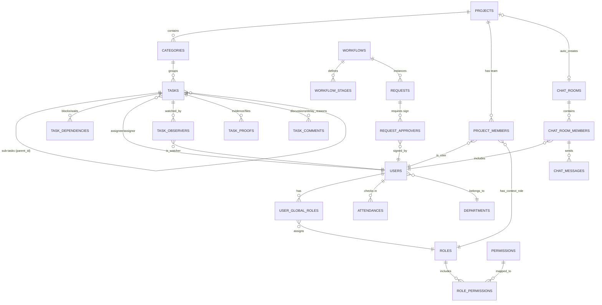

# TÀI LIỆU KIẾN TRÚC DỮ LIỆU & ERD: HỆ THỐNG QUẢN LÝ TỔNG THỂ (ERP/MES)

## 1. KIẾN TRÚC TỔ CHỨC & PHÂN QUYỀN (CORE RBAC & ORG)
Để giải quyết bài toán "các role default, các role tương lai người dùng dự add vào", hệ thống KHÔNG hard-code role trong source code. Chúng ta thiết kế theo mô hình **RBAC (Role-Based Access Control)** kết hợp **Resource/Context**.

### 1.1. Các Entities cốt lõi
* **`users`**: Chứa thông tin cơ bản, trạng thái rảnh/bận (`availability_status`) và tọa độ GPS hiện tại (`last_location`).
* **`departments`**: Phòng ban (Khối Dự án, Khối Office, Kế toán, Kỹ thuật...). Có cấu trúc cây (`parent_id`) để tạo phòng ban con.
* **`skills` / `job_titles`**: Gắn nhãn kỹ năng (Thợ điện, Thợ hàn...) để lọc nhân sự rảnh việc.
* **`roles`**: Bảng chứa danh sách Role.
    * *Các Role Default:* System Admin, Giám đốc, Trưởng phòng, PM, QA/QC, Thợ, Kế toán.
    * *Cấu trúc:* `role_id`, `role_name`, `role_level` (Cấp 1-Board, 2-Manager, 3-Staff).
* **`permissions`**: Bảng chứa danh sách "động từ" hệ thống. VD: `CREATE_TASK`, `APPROVE_REQUEST`, `VIEW_SALARY`.
* **`role_permissions`**: Bảng trung gian nối Role và Permission. Khi user thêm Role mới ở tương lai, họ chỉ cần tick chọn các Permission cho Role đó trên giao diện web.

### 1.2. Logic Phân quyền Kép (Global vs Contextual)
Một người có thể là "Nhân viên" ở công ty (Global), nhưng lại là "Quản lý" trong Dự án A (Contextual).
* **`user_global_roles`**: Quyền toàn hệ thống (VD: Kế toán trưởng được xem toàn bộ lương).
* **`project_members`**: Cầu nối User vào Dự án. Chứa trường `project_role_id` (VD: User A làm PM ở Dự án X, làm Observer ở Dự án Y).

---

## 2. MODULE QUẢN LÝ DỰ ÁN & CÔNG VIỆC (PROJECT & TASK)
Module này có cấu trúc cây (Tree Structure) và logic phụ thuộc chéo (Dependency).

### 2.1. Các Entities cốt lõi
* **`projects`**: Thông tin tổng quan (Tên, Mã, Department phụ trách, PM, Start/End date).
* **`categories` (Hạng mục)**: Thuộc về Project. (VD: Hạng mục Điện, Hạng mục Nước).
* **`tasks`**: Thực thể phức tạp nhất.
    * *Fields:* `task_id`, `parent_task_id` (để tạo sub-task), `name`, `status` (Todo, Doing, Review, Done, Overdue), `priority`, `start_time`, `end_time`.
    * *Relations:* `assignor_id` (Người giao), `assignee_id` (Người nhận chính), `department_id` (Việc của phòng nào).
* **`task_observers`**: Bảng trung gian (N:N) lưu danh sách những người "Chỉ xem, theo dõi, không sửa".
* **`task_dependencies`**: Bảng lưu quan hệ Trễ hạn dây chuyền. (VD: Task B phụ thuộc Task A. Nếu A trễ, trigger tự động đẩy `start_time` của B lên).
* **`task_proofs`**: Bảng lưu hình ảnh/file nghiệm thu của Task (ngăn chặn cập nhật láo). Yêu cầu check GPS và Time-stamp từ Mobile App.
* **`task_comments`**: Lưu thảo luận, đặc biệt là loại comment `is_delay_justification = true` (Dùng để giải trình khi task bị Overdue).
* **`recurring_tasks`**: Bảng lưu cấu hình lặp lại (Cron job pattern) để tự động sinh ra `tasks` mới.

---

## 3. MODULE QUY TRÌNH & ĐỀ XUẤT (WORKFLOW & E-OFFICE)
Hỗ trợ Agile (Sản xuất) và Approvals (Phiếu mua hàng, tạm ứng).

### 3.1. Các Entities cốt lõi
* **`workflows`**: Khuôn mẫu quy trình (VD: "Quy trình mua hàng", "Quy trình sản xuất panel").
* **`workflow_stages`**: Các bước trong quy trình. VD: Bước 1 (Nhận đơn) -> Bước 2 (Kế hoạch) -> Bước 3 (QA/QC). Gắn `role_id` được phép thực thi tại bước này.
* **`requests` (Phiếu đề xuất)**: Dữ liệu thực tế khi user tạo phiếu. Link với `workflow_id`. Phân loại theo `amount_threshold` (Hạn mức tiền).
* **`request_approvers`**: Lưu danh sách những người phải duyệt (Nhiều cấp). Có trường `signature_url` để lưu chữ ký điện tử.

---

## 4. CHẤM CÔNG, CHAT & AUDIT (TIMEKEEPING, CHAT, LOGS)

### 4.1. Entities
* **`attendances`**: `user_id`, `check_in_time`, `check_out_time`, `gps_lat`, `gps_long`, `device_info`, `method` (FaceID/Fingerprint/GPS), `location_id` (Công trường đang check-in).
* **`chat_rooms`**: Bảng nhóm chat. Có trường `project_id` (nếu khác null -> Đây là group chat tự động sinh ra khi tạo Dự án).
* **`chat_messages`**: Tin nhắn lưu vĩnh viễn, đính kèm `file_url`.
* **`audit_logs`**: Bảng Tracking mọi hành động (Ai, làm gì, lúc nào, bảng nào, old_value, new_value). Không bao giờ xóa (Append-only).

---

## 5. SƠ ĐỒ THỰC THỂ LIÊN KẾT (ERD)

Sơ đồ kiến trúc dưới đây được viết bằng cú pháp Mermaid. Hệ thống GitHub, Notion, hoặc Obsidian sẽ tự động render đoạn code này thành hình ảnh.

---

## 6. LỜI KHUYÊN KIẾN TRÚC CHO APP MOBILE (MOBILE-FIRST)

1.  **Lightweight Payload (Dữ liệu trả về nhẹ):** Trên Mobile (nhất là 3G/4G công trường), API get danh sách Task không được `SELECT *`. Chỉ query các trường cần thiết (Tên, Trạng thái, Avatar Assignee) để render giao diện Dashboard nhanh nhất.
2.  **Offline-first Synchronization:** Thợ ở công trường hầm máy lạnh (mất sóng) vẫn phải bấm "Hoàn thành" công việc được. App Mobile lưu trạng thái ở Local SQLite, khi có mạng 4G lại, gọi API đồng bộ (Sync) lên bảng `tasks` và upload `task_proofs` lên Cloud.
3.  **Push Notification Gateway:** Bảng `tasks` và `requests` khi đổi trạng thái (Trễ hạn, Có người duyệt phiếu) phải trigger qua Message Queue (như Redis/RabbitMQ) bắn Socket xuống Firebase Cloud Messaging (FCM) để điện thoại rung/nhận thông báo tức thì, không cần mở app.